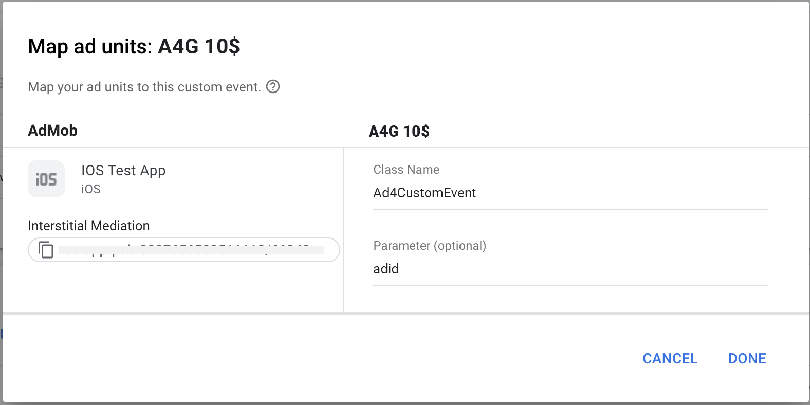

Ad4Game iOS adapter for Admob.

## Features
- [x] Banner
- [x] Interstitial
- [x] Rewarded
 
## Requirements

- iOS 10.0+
- GoogleMobileAds 9.13+

## Installation

### CocoaPods

```ruby
pod 'Ad4AdmobMediation',:git =>'https://github.com/ad4game/a4g-admob-ios.git','1.1.0'
pod 'Google-Mobile-Ads-SDK','9.13.0'
```

### Configure mediation settings for your AdMob ad unit

You need to add Ad4Game placements provided by the Ad4Game team to the mediation configuration as waterfall ad source for your ad unit.




**Custom Event screen parameters**<br />
**Class Name** : Ad4CustomEvent<br />
**Parameter** : Ad4Game Unit ID<br />